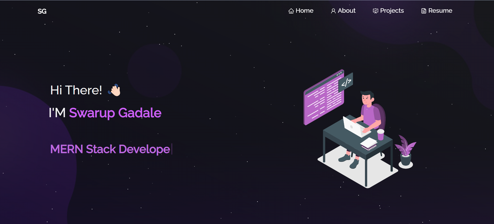

<h2 align="center">
  Portfolio Website 
  <a href="https://swarup-portfolio.onrender.com" target="_blank">swarup-portfolio</a>
</h2>

  

 

  
  
  

## TL;DR

Feel free to fork this repo to modify and make changes of your own. Please give me proper credit by linking back to [Gadale-Swarup](https://github.com/Gadale-Swarup/Portfolio/). Thanks!

## Built With

My personal portfolio [swarup-portfolio.onrender.com](https://swarup-portfolio.onrender.com) features some of my GitHub projects, resume, and technical skills. This project was built using the following technologies:

- React.js
- CSS3
- VsCode
- Render

## Features

- **📖 Multi-Page Layout**
- **🎨 Styled with React-Bootstrap and CSS3 with easy-to-customize colors**
- **📱 Fully Responsive**

## 🛠 Installation and Setup Instructions

1. **Installation**: Run `npm install` to install the required dependencies.
2. **Running the App**: In the project directory, you can run `npm start`.

   This runs the app in development mode. Open [http://localhost:3000](http://localhost:3000) to view it in the browser. The page will reload if you make edits.

## Usage Instructions

Open the project folder and navigate to `/src/components/`. You will find all the components used, and you can edit your information accordingly.

### Show Your Support

Give a ⭐ if you like this website!

[View Demo](https://swarup-portfolio.onrender.com)
